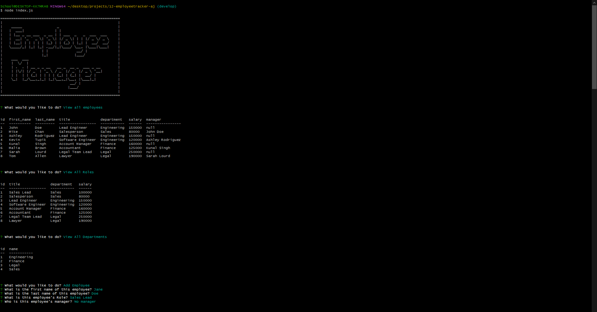

# Module 12 Employee Tracker Project

## Description

This is Adrian Jimenez's module 12 Employee Tracker challenge submission. 

I initially began this project by setting up a directory tree. I imported my npm packages and set up initial functionality. Once initial setup was complete, I began by creating a function to display "Employee Manager" as ascii art into the terminal. I exported that function for use in index.js and worked on creating a database to connect to using .sql files. I created a connection.js file for the program to know what credentials to use and which database to connect to in mysql. Then I created a DB (database) class with methods which would query for specific things using the connection from connection.js and the mysql2 package. This allowed me to get the responses I desired and use inquirer to set up prompts in index.js, and use the console.table package to log the mysql data into the terminal. Once that was complete the application was finished. 

## Table of Contents

- [Installation](#installation)
- [Languages](#languages)
- [Usage](#usage)
- [Credits](#credits)
- [License](#license)
- [Contributing](#contributing)
- [Questions](#questions)

## Installation

In order to install this project, download all files and have node.js installed on your machine. Navigate to the directory in which index.js is stored in and type: 

    npm install

Once all dependencies have been downloaded, you can excecute index.js by typing node index.js.

## Technologies Used

* JavaScript
* Node.JS
* MySQL
* console.table
* mysql2
* inquirer

## Usage

* [See Video 1:](https://drive.google.com/file/d/1e58ytS1gZ4xnGSdvnW1Znon5Ya-Z4OXX/view?usp=sharing)

In order to use this project, please change the credentials in db/connection.js and set up the database using the schema.sql file in the db directory. once that is set up simply execute node index.js and the application should start.

## Credits

* Adrian Jimenez

## License

This project is licensed under the MIT License. See [LICENSE.md](./LICENSE.md) for more details.

---

## Contributing

This project follows the contributor covenant contribution guidelines. See [here](https://www.contributor-covenant.org/version/2/1/code_of_conduct/) 

## Questions

If you have any questions or concerns visit my [github](https://github.com/PuppetAJ) or send me an email at <adrianjimenez1950@gmail.com>. 

